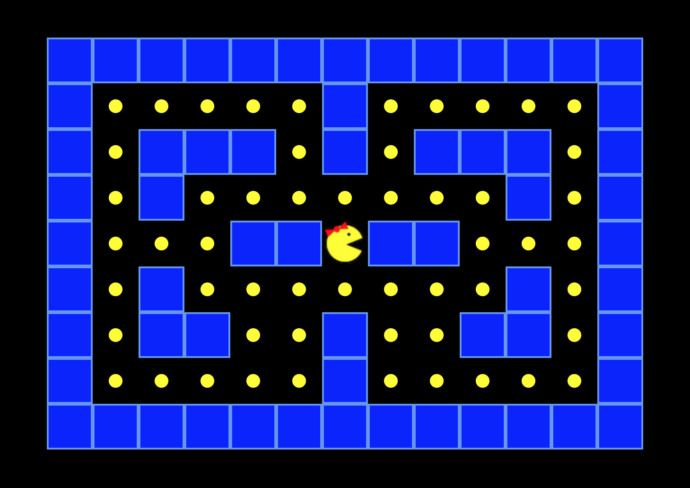

# MizPacman: a simple game in JavaScript + CSS + HTML

Thanks to DojoAcademy for the [original tutorial](https://www.twitch.tv/videos/160904036)!

This is an adaptation of their code, for [DigitalCrafts](https://www.digitalcrafts.com/)'s JavaScript meetup.

# Goals

This is not a full game. It's a way to demonstrate how web pages work.
It relies only on the core technologies found in every modern browser: HTML, CSS, and JavaScript.

## Review questions

By the end of the tutorial, you should be able to answer these questions:

- How does a browser work with HTML?
- How does the browser draw?
- What does CSS stand for?
- How do you make a web page use CSS?
- What is the box model?
- In CSS, what is the cascade?
- How do you make a web page interactive?
- How do you make a web page use javascript?
- What is a variable?
- What is a function?
- What is an event?

## Guidelines

To get the most out of this tutorial:

- Grab starter code (zip file)
- Follow along, but don't worry about typing everything.
  - (The final version is in on Github!)
- Yes, the video will be available!

## Setup

- Open the project code your text editor.
  - I'm using [Visual Studio Code](https://code.visualstudio.com/), but these are also good (and free):
    - [Atom](https://atom.io/)
    - [SublimeText](https://www.sublimetext.com/)
    - [TextMate](https://macromates.com/)

# Overview: How do web pages work?

Most web pages are built using these three technologies: HTML, CSS, and JavaScript

## what is html

- HTML stands for HyperText Markup Language
- You write HTML using tags, of which there are many.
- A `
` is a generic tag, great for games, not great when you need more specific tags.
  - (For example, the HTML for a blog post should use paragraph tags: `
`.)
- Tags are meant to structure and organize your content.
- Your content can be text, images, video, etc.
- You can nest tags inside one another.
  - You might have a paragraph (as a p tag) and an anchor tag (an a tag).
  - In this case, the anchor tag is nested inside of the paragraph tag

## What is CSS

- CSS stands for Cascading Style Sheets.
- The tags you write in your html have to be drawn to the screen.
- For every tag, the browser draws a rectangle.
- You have to tell the browser how to draw the rectangles.
- There are default styles built into the browser, but you can specify custom ones.
- The best way to associate styles with an element on the page? use classes

## Using JavaScript

- A variable is a programming term for a label or an identifier.
  - You need variables so that you can refer to data using a convenient name.
- What is a function?
  - A function is like a recipe, which contains one or more steps.
  - A function can be used over and over again.
  - Usually, a function takes input (called "arguments") and returns output.
- What is an event?
  - As you click, tap, scroll, and type, your browser responds. Each of these interactions is called an event.
  - You can customize how the browser responds by writing functions that handle different kinds of events.

# Some handy keyboard shortcuts in vs code:

- move line up/down: `opt + up/down`
- toggle comment: `cmd + /`

You can find a listing of more shortcuts [on the vs code website](https://code.visualstudio.com/docs/getstarted/keybindings).

